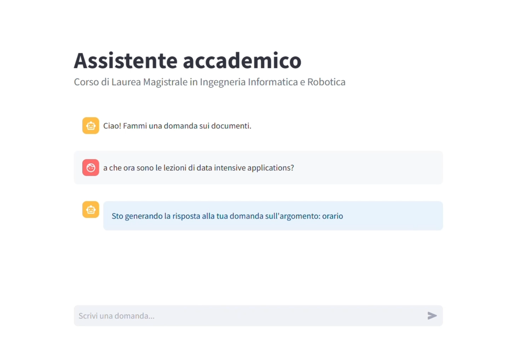
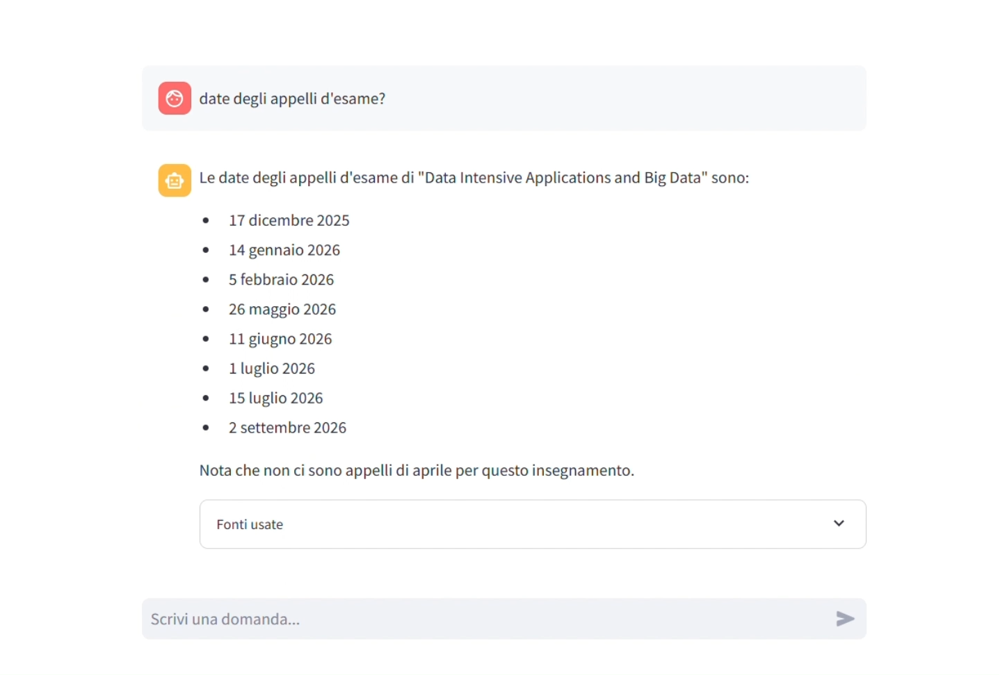
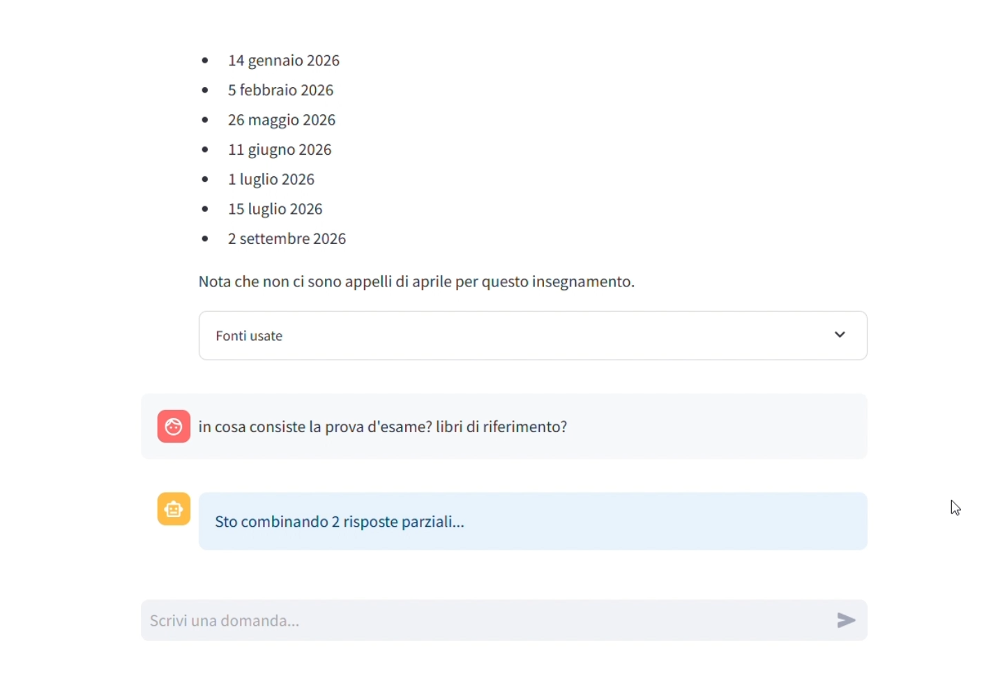
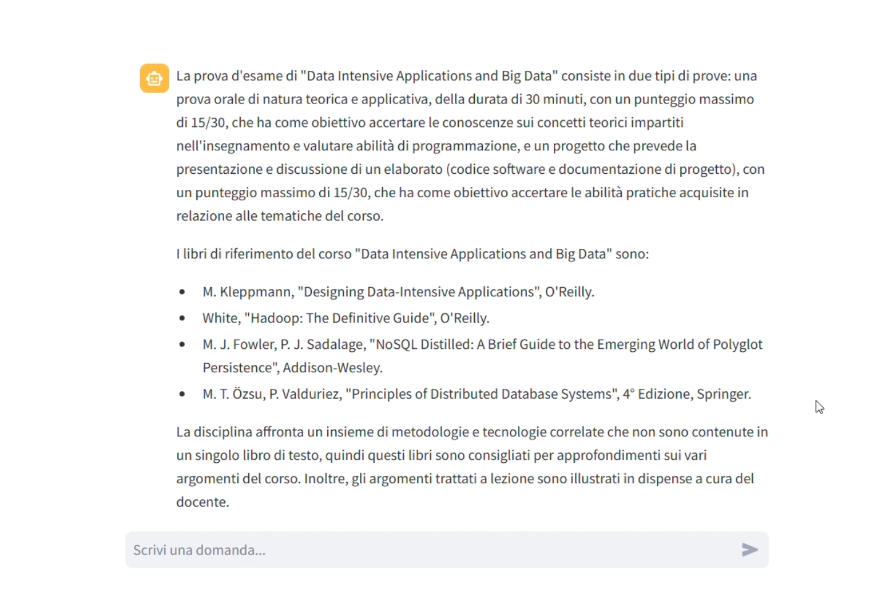

# Assistente Accademico Intelligente basato su RAG

> **Progettazione e Sviluppo di un Assistente Accademico Intelligente basato su Retrieval-Augmented Generation**
>
> Tesi Magistrale — Corso di Laurea in Ingegneria Informatica e Robotica, UniPG (A.A. 2024/2025) —
> Candidato: Michele Mariotti | Relatore: Prof. Fabrizio Montecchiani

---

## Indice

- [Motivazione e Obiettivo](#motivazione-e-obiettivo)
- [Informazioni Gestite](#informazioni-gestite)
- [Architettura del Sistema](#architettura-del-sistema)
- [Fondamenti del RAG](#fondamenti-del-rag)
- [Progettazione e Sviluppo](#progettazione-e-sviluppo)
  - [Database Vettoriale: Qdrant](#database-vettoriale-qdrant)
  - [Moduli di Acquisizione e Indicizzazione](#moduli-di-acquisizione-e-indicizzazione)
  - [Scelta delle Configurazioni](#scelta-delle-configurazioni)
  - [Strategie di Chunking](#strategie-di-chunking)
  - [Modello di Embedding](#modello-di-embedding)
  - [Strategie di Retrieval](#strategie-di-retrieval)
  - [Costruzione del Contesto e Generazione](#costruzione-del-contesto-e-generazione)
  - [Grafo di Stati (Advanced RAG)](#grafo-di-stati-advanced-rag)
- [Scenario di Utilizzo](#scenario-di-utilizzo)
- [Conclusioni e Sviluppi Futuri](#conclusioni-e-sviluppi-futuri)

---

## Motivazione e Obiettivo

L'accesso alle informazioni accademiche è una necessità quotidiana per studenti, docenti e personale amministrativo. Tuttavia, i portali universitari, pur contenendo una grande quantità di informazioni, sono organizzati su diverse pagine e documenti, rendendo la ricerca di informazioni specifiche dispersiva e poco immediata.

In tale contesto nasce questo progetto: un **assistente conversazionale** che permette agli utenti di porre domande in linguaggio naturale e di ottenere risposte specifiche con riferimento alle fonti originali, senza dover navigare manualmente tra le pagine del portale.

---

## Informazioni Gestite

Il sistema è stato progettato e sviluppato per il Corso di Laurea Magistrale in Ingegneria Informatica e Robotica di UniPG, gestendo:

- Regolamenti didattici e informazioni sugli insegnamenti (CFU, obiettivi formativi, prerequisiti, contenuti, modalità d'esame, ecc.)
- Orari delle lezioni e calendario delle attività didattiche
- Calendari degli appelli d'esame e di laurea
- Informazioni su tirocini, tutorato e programma Erasmus
- Procedure per l'iscrizione e per l'utilizzo delle strutture e laboratori didattici

> Per cambiare corso di laurea è sufficiente sostituire la base di conoscenza.

---

## Architettura del Sistema

Il progetto è stato sviluppato nell'ambito di un lavoro di team che ha previsto la progettazione congiunta dell'intera architettura, composta da due componenti principali:

- **Infrastruttura server**: espone e gestisce i servizi necessari per l'esecuzione dei modelli (LLM, embedding, reranking)
- **Sistema RAG**: il contributo principale di questa tesi, descritto in dettaglio nelle sezioni seguenti

---

## Fondamenti del RAG

Il **Retrieval-Augmented Generation (RAG)** è un approccio architetturale che integra un Large Language Model (LLM) con una base di conoscenza esterna, permettendo il recupero di informazioni aggiornate e pertinenti da utilizzare al momento della generazione della risposta.

Gli LLM hanno un limite importante: la loro conoscenza si limita a quella dei dati di addestramento. Il RAG risolve questo problema articolandosi in tre fasi:

**1. Indexing** — preparazione della base di conoscenza  
**2. Retrieval** — recupero dei documenti più rilevanti rispetto alla domanda  
**3. Generation** — i documenti recuperati vengono combinati con la domanda e passati al modello per generare una risposta accurata e aggiornata

### Perché RAG e non Fine Tuning?

| | Fine Tuning | RAG |
|---|---|---|
| **Conoscenza** | Incorporata nei pesi del modello | Separata dal modello generativo |
| **Aggiornamento** | Nuovo ciclo di addestramento (costi elevati) | Aggiornare la base documentale |
| **Idoneità al dominio** | Non adatto a documenti che cambiano periodicamente (calendari, orari, regolamenti) | Scelta naturale: risposte accurate, aggiornate e tracciabili |

---

## Progettazione e Sviluppo

### Database Vettoriale: Qdrant

È stato scelto **Qdrant**, un database vettoriale open-source progettato per la memorizzazione e la ricerca efficiente di vettori mediante strutture di indicizzazione. Offre:

- Ricerca per similarità tramite diverse metriche di distanza (cosine distance)
- Filtraggio basato sui metadati
- Gestione di collezioni distinte

### Moduli di Acquisizione e Indicizzazione

L'indicizzazione è stata realizzata con quattro moduli distinti:

**`scraping.py`** — raccoglie i contenuti delle pagine web, gestisce il download dei PDF trovati, estrae e filtra i link presenti nel main della pagina

**`crawling.py`** — implementa la logica di navigazione ricorsiva a partire da un URL seme, con una strategia di visita per livelli: esplora tutte le pagine raggiungibili alla profondità corrente prima di procedere a quelle del livello successivo

**`parsing.py`** — pulisce e organizza il testo in chunk; ciascun chunk viene incapsulato in un oggetto e arricchito di metadati

**`indexing.py`** — punto di avvio del processo; legge da un file di testo una lista di URL organizzati in blocchi (collezioni), con parametri per selezionare la profondità massima di navigazione e per abilitare o disabilitare il download dei PDF

### Scelta delle Configurazioni

Per supportare il confronto tra le diverse configurazioni è stato utilizzato **RAGAS** (*Retrieval Augmented Generation Assessment*), una libreria dedicata alla valutazione di sistemi RAG con metodologia LLM-as-a-judge.

A tale scopo è stato costruito un validation set di 129 domande, progettate per coprire aspetti contenuti nell'intero insieme dei documenti. Nonostante lo strumento risulti utile per una scrematura delle configurazioni, si è rivelato non pienamente affidabile nel riflettere la qualità reale delle risposte, per cui le configurazioni più promettenti sono state successivamente analizzate tramite valutazione umana. Le configurazioni adottate sono il risultato di un processo iterativo di sperimentazione.

Le metriche di valutazione utilizzate sono:

| Metrica | Descrizione |
|---|---|
| **Faithfulness (F)** | Risposta fedelmente supportata dai contesti recuperati |
| **Answer Relevancy (AR)** | Risposta rilevante rispetto alla domanda posta |
| **Answer Correctness (AC)** | Correttezza della risposta rispetto alla risposta attesa |
| **Context Precision (CP)** | Precisione del retrieval |
| **Context Recall (CR)** | Completezza del retrieval |

### Strategie di Chunking

Sono state sperimentate quattro strategie:

**Fixed-size** — il testo viene suddiviso in segmenti di lunghezza fissa con overlap tra chunk consecutivi. Vantaggio: dimensione prevedibile. Svantaggio: può spezzare contesti semantici.

**Document structure-based** — ogni elemento HTML viene inserito in un chunk indipendente. Scartato rapidamente in quanto produceva chunk troppo granulari.

**Section-based** — i chunk rispettano la struttura a sezioni del documento: ogni volta che si incontra un header, il chunk corrente viene chiuso e ne viene aperto uno nuovo. Vantaggio: coerenza semantica naturale. Svantaggio: lunghezza variabile dei chunk, con rischio di saturare la finestra di contesto del modello.

**Semantic** — il testo viene suddiviso in piccole unità, per ciascuna delle quali viene calcolato un embedding; le unità vengono poi aggregate in modo greedy (si aggiunge l'unità successiva se la similarità tra il suo embedding e l'embedding medio del chunk supera una soglia). Vantaggio: chunk semanticamente coerenti indipendentemente dalla struttura. Svantaggio: costo computazionale elevato.

I test con RAGAS hanno evidenziato come le prestazioni del semantic si siano rivelate comparabili, se non inferiori, a quelle del fixed-size e del section-based, non giustificando il costo aggiuntivo.

**Scelta finale: Section-based Limited Chunking** — approccio ibrido che applica la logica del section-based introducendo un limite massimo alla lunghezza dei chunk (4000 caratteri). Se un chunk supera tale soglia, viene suddiviso cercando di rispettare i confini di frase (punti, interruzioni di riga), con il titolo della sezione replicato all'inizio di ciascun chunk. Risultato: chunk di dimensione controllata ma semanticamente coerenti.

### Modello di Embedding

Sono stati confrontati quattro modelli di embedding:

| Modello | Dimensionalità |
|---|---|
| nomic-embed-text | 768 |
| all-mpnet-base-v2 | 768 |
| e5-base-v2 | 768 |
| **bge-m3** ✅ | **1024** |

Il modello scelto è **bge-m3**, che produce vettori di dimensionalità superiore (1024), consentendo rappresentazioni semantiche più ricche, come riscontrato nei test.

### Strategie di Retrieval

Sono state valutate tre tipologie di ricerca:

- **Sparsa**: basata su metodi lessicali (TF-IDF o BM25)
- **Densa** ✅: basata sugli embedding — ricerca per similarità vettoriale tramite cosine distance
- **Ibrida**: combina entrambe le modalità

La scelta è ricaduta sulla **ricerca densa**, risultata la più performante nei test.

Nella fase di retrieval, la query viene convertita nello stesso spazio vettoriale utilizzato in fase di indicizzazione e si calcola la similarità tra il vettore della query e i vettori presenti nel database tramite cosine distance. Negli embedding la direzione del vettore rappresenta il contenuto semantico, rendendo questa metrica particolarmente adatta.
Infine, in base ai valori calcolati, vengono selezionati i chunk più rilevanti, che andranno a costituire il contesto fornito al modello generativo.

### Costruzione del Contesto e Generazione

La fase di generazione prende in input un prompt strutturato contenente:

- Lo storico della conversazione (ultimi 4 turni)
- La query dell'utente
- I chunk recuperati (etichettati `[Fonte N]`)
- Il system prompt con istruzioni sul comportamento atteso

E produce in output una **risposta basata sul contesto**, riportando le fonti utilizzate.

### Grafo di Stati (Advanced RAG)

Il RAG base (Naive RAG) presenta dei limiti in caso di query ambigue, dipendenti dal contesto conversazionale, o in situazioni in cui il retrieval base fallisce. Per affrontarli, il sistema è stato esteso con tecniche proprie dei paradigmi **Advanced e Modular RAG**, integrate in un'architettura orchestrata tramite un **grafo di stati** realizzato con il framework **LangGraph**, in cui i nodi rappresentano operazioni e gli archi determinano il flusso di esecuzione.

*Grafo di stati della pipeline RAG*

I nodi principali del grafo sono:

**Decomposizione delle domande composite** — risolve i casi in cui una singola fase di retrieval non riesce a coprire tutti gli aspetti della query. Il modello determina se la domanda è singola (flusso diretto) o composta, e in questo caso la suddivide in sottodomande istanziate come esecuzioni indipendenti. Le risposte parziali vengono poi riordinate e sintetizzate dall'LLM in un'unica risposta coerente.

**Classificazione della query** — classifica la domanda in categorie. Ha un duplice effetto sulla pipeline: filtraggio delle collezioni (indirizza il retrieval solo sulle collezioni pertinenti) e task-specific prompting (seleziona un prompt specifico per il tipo di domanda). Le query "semplici" bypassano il retrieval e ottengono una risposta diretta.

**Query Rewriting** — tecnica pre-retrieval che riformula la query incorporando il contesto conversazionale. Particolarmente utile nelle conversazioni multi-turno, in cui le domande possono contenere riferimenti impliciti a turni precedenti.

**Retrieval con Reranking** — nel retrieval vengono recuperati 2k candidati; un cross-encoder (`bge-reranker-v2-m3`) valuta congiuntamente ogni coppia (query, chunk) e riordina i candidati per pertinenza, selezionando infine i top-k chunk da passare alla generazione.

**Valutazione e Fallback** — la risposta generata viene sottoposta a valutazione da parte del modello stesso. In caso di risposta insufficiente, il sistema attiva strategie di fallback come l'espansione della query (riformulazione in più versioni alternative) e un reranking su un insieme di candidati più esteso.

---

## Scenario di Utilizzo

> **Esempio — Recupero informazioni su un insegnamento**

Di seguito alcuni screenshot che mostrano il sistema in azione durante una conversazione multi-turno su un insegnamento:

**1. Orario delle lezioni** — la domanda viene **classificata** come argomento *orario*, indirizzando il retrieval sulla rispettiva collezione:

**2. Date degli appelli d'esame** — lo studente chiede le date senza rispecificare il nome del corso; grazie al **query rewriting contestuale** il sistema ricostruisce la domanda completa e risponde correttamente:

**3. Prova d'esame e libri di riferimento** — domanda composita: con un singolo retrieval farebbe fatica a recuperare i documenti necessari per rispondere ad entrambi gli aspetti, per cui viene **scomposta in 2 sottodomande** elaborate indipendentemente e poi combinate in un'unica risposta finale:

---

## Conclusioni e Sviluppi Futuri

È stato realizzato un **sistema RAG avanzato** per un assistente accademico capace di gestire scenari realistici e variegati, fornendo risposte accurate e contestualizzate.

Possibili sviluppi futuri:

- **Multi-corso**: supporto simultaneo a più corsi di laurea con basi di conoscenza distinte
- **Integrazione fine tuning (ibrido con RAG)**: specializzare stile e terminologia con cui il modello genera le risposte al dominio universitario
- **Test con utenti reali**: riscontro diretto sull'efficacia nel contesto d'uso reale
